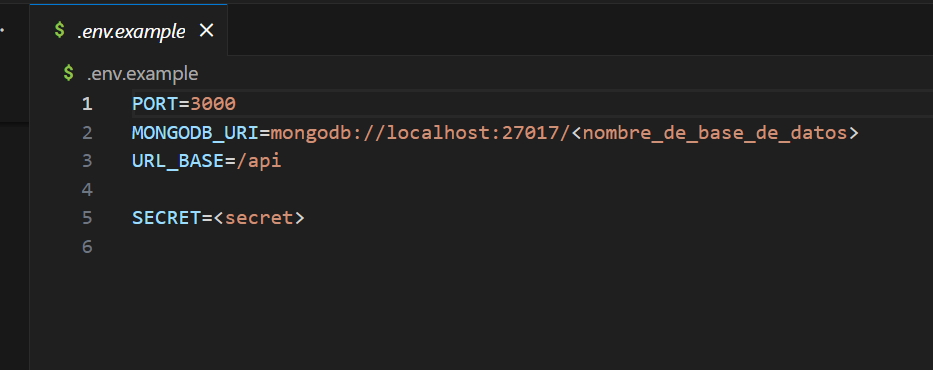
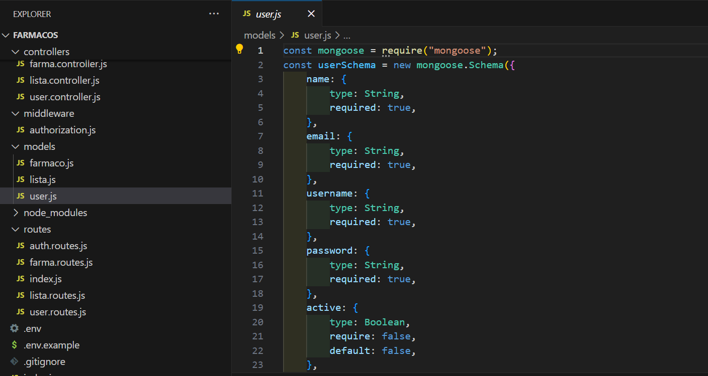
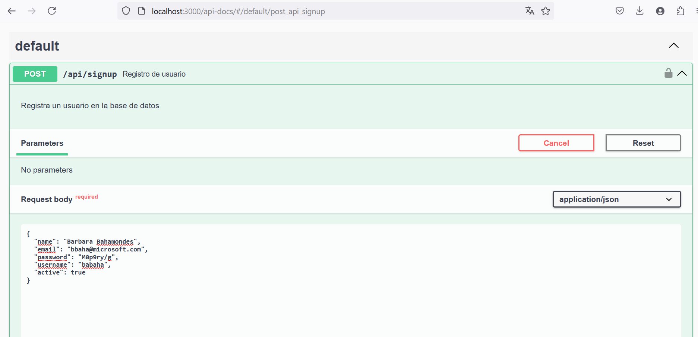
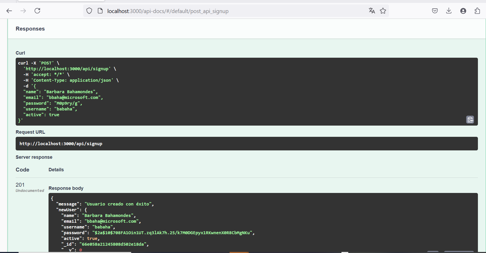

# Módulo 6 - Proyecto 6
## ¡Bienvenidos al proyecto "Aplicación Backend con Autenticación"!

## Tabla de Contenidos
* [1. Desafío](#1-Desafío)
* [2. Desarrollo de proyecto](#2-Desarrollo-de-proyecto)
* [3. Conclusiones](#3-Conclusiones)

****
## Desarrollo

### 1. Desafio
 Para este sexto proyecto se solicita crear una aplicación backend con autenticación, en donde se cumplirán las siguientes actividades:
 - Foco en seguridad en las aplicaciones web, sobre la aplicación backend con funciones de autenticación y autorización utilizando tecnologías como JWT (JSON Web Tokens). Así como también herramientas pueden ser utilizadas para implementar mecanismos de autenticación en los servidores.
 - La aplicación deberá cumplir con una estructura de tal manera que incluya dos modelos principales, uno para el Usuario y otro para Producto (y/o elemento). Para este proyecto, los productos serán considerados como "Fármacos", asi como modelo de usuaros y listas. Esto será interrelacionado por medio de MongoDB (como Base de Datos) y Mongoose (como ORM para facilitar esta interacción).
 - Complementando lo anterior, se utilizará Swagger para el proceso de documentación.
 - Además de implementar el proceso de CRUD (Crear, Leer, Actualizar, Borrar) al desarrollar los servicios. Se utilizará express.js y cors, y además de estructurar tus carpetas con controladores, modelos y rutas. Así como aplicar dotenv (para el manejo de las variables de entorno).
 - Utilizar MongoDB Atlas para el despliegue de la base de datos y render.com para la entrega del proyecto.

  ****

### 2. Desarrollo de proyecto
 La idea principal del proyecto es sobre la problemática que a veces pasan las personas o familias en general en donde uno o varios integrantes pueden estar con diferentes tratamientos famacológicos, con el fin de evitar enredos o confusiones de horarios, o largo de tratamiento, asi como dosis entre otras variables se dió con esta aplicación que permitirá a los usuarios que puedan registrar farmacos, y crear listas para asociar con farmacos (uno o más en un array) y categorizarlos por tratamientos, u otros en base a ID´s, de esta forma podrán acceder a la información que necesiten, asi como establecer duración de los tratamientos o el objetivo de un fármaco entre otros. Adicionalmente se construye la generación de Token por medio de "SignIn" con el fin de poder autenticarse para acceder a la información de usuarios en específico.
 Para el análisis del proyecto, se parte desde la estructura base que define los controladores, modelos y rutas. En donde:
  - Modelos está compuesto por estructuras de usuarios, farmacos y listas.
  - Controladores, contiene autenticación, farmaco, listas y usuarios.
  - Rutas, desde index para gestionar las rutas de usuario, lista, farmaco y autenticación
    
  

 Adicionalmente se crean las variables de entorno, y por razones de seguridad se proteje user y password del acceso a mongoDB, además se muestra las variables de entorno de ejemplo:

 Archivo .env:
 
 

 Archivo .env.example:
 
  

 Y en MongoDB Compass, se habilitan desde la colección de "test", los datos por users, farmacos y listas:

 

 Sobre los modelos, se muestra a continuación un extracto de modelo de usuario, farmaco y lista:
 - Modelo user:
   
 
 
 - Modelo fármaco:
   
 
 
 - Modelo lista:
   
 

  A modo de ejemplo se muestra un extracto del controlador de usuario:
  
  
 
  Sobre el proceso de registro (signUp) y signIn, se muestra a continuación un extracto:
  
  

  Y el funcionamiento de autorización, con JWT:
  
  

  Para ir validando CRUD se fue probando desde Insomnia, como se ve a continuación:

   

  Se adjuntaron adicionalmente 3 archivos de prueba con usuarios, farmacos y listas:
  - usuarios_prueba
  - farmacos_prueba
  - listas_prueba
 
  Sobre Swagger, se muestra un extracto de la documentación, desde "http://localhost:3000/api-docs/":
  
    

  Se muestra extracto de la documentación del proceso de SignUp de un usuario, primero ingresando los datos:
  
    

  Y confirmación del proceso de Alta de usuario exitoso:
  
    

  Finalmente se incluye link de render para la publicación del proyecto, con Swagger:
  [link Render](https://proyecto-6-aplicacion-backend.onrender.com/api-docs/)
  
  ****

  ### 3. Conclusiones
 Para la preparación del proyecto de "Aplicación Backend con autenticación", se analizaron diferentes variables con el fin de hacer un proyecto interesante, que luego de varias revisiones y diferentes ideas con ejecuciones de pruebas, se llegó a la idea de crear esta forma de gestión de fármacos y dar la opción de agrupar por listas, de esta forma si en una familia están bajo diferentes tratamientos médicos, se pueda llevar un registro ordenado de los fármacos.
 Se presentaron varios desafíos durante la creación del código, además de comprender la estructura de código de Swagger, y pero gracias a reiteradas pruebas, se logró dar con la ccorreción de errores, aso como revisiones desde Insomnia, para posteriormente finalizar con su documentación en Swagger.
 
  ****
*¡Gracias!*
